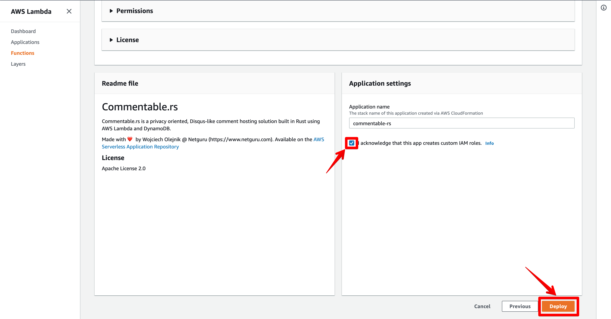
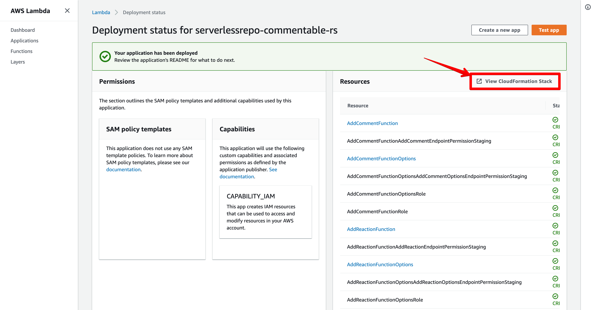
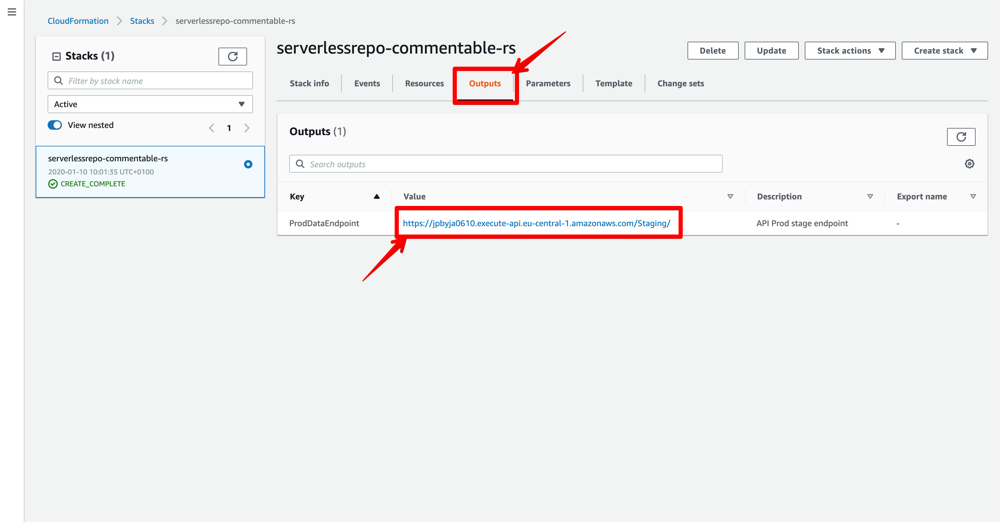

## Commentable.rs - A privacy oriented, serverless comment hosting solution written in Rust.

#### This repository contains the backend part of Commentable.rs, if you're looking for client-side libraries, see [https://github.com/netguru/commentable-js](https://github.com/netguru/commentable-js)

### Why?
The biggest selling point of Commentable.rs is the fact that it can be installed in less than a minute, is completely self-hosted and scales with your traffic thanks to the Serverless architecture.
It supports regular comments, nested replies (with unlimited depth) and custom reactions.
It uses Single Sign On with Google Auth and if your website already supports it, the authentication process is 100% automatic (that means users don't have to log in twice to post a comment like in other similar solutions)

### How?
Commentable.rs is written in the [Rust programming language](https://www.rust-lang.org/) and running on [AWS Lambda](https://aws.amazon.com/lambda/) to achieve high scalability.
It uses [AWS DynamoDB](https://aws.amazon.com/dynamodb/) for storage, which is a NoSQL database with a very flexible billing system. This choice of architecture allows users to install the whole app with just one press of a button. It also makes it free-tier eligible, which is very handy for small websites and during development (we were never billed more than $0, even during heavy testing).

### Installation
The easiest way to install Commentable.rs is by using AWS Serverless Application Repository. Log in to you AWS account then visit [this link](https://serverlessrepo.aws.amazon.com/applications/arn:aws:serverlessrepo:us-east-2:403528576742:applications~commentable-rs) and press `Deploy`.
Follow these screenshots to get to the Url of your new application:







Alternatively, if you want, you can easily install Commentable.rs using the command line. You will need Docker for compilation as well as AWS CLI and AWS SAM CLI for deployment. The whole process is abstracted into a single make command, which makes it very straightforward.

[How to install AWS CLI](https://docs.aws.amazon.com/cli/latest/userguide/cli-chap-install.html)

[How to configure AWS CLI](https://docs.aws.amazon.com/cli/latest/userguide/cli-chap-configure.html#cli-quick-configuration)

[How to install AWS SAM CLI](https://docs.aws.amazon.com/serverless-application-model/latest/developerguide/serverless-sam-cli-install.html)

[How to install Docker](https://docs.docker.com/install/)

```shell
$> git clone git@github.com:netguru/commentable-rs.git
$> cd commentable-rs
# <your_bucket_name> is the name of the AWS S3 bucket that will contain your binaries - it has to be globally unique so you need to provide your own name
$> BUCKET_NAME=<your_bucket_name> make install
```

### Configuration
No additional configuration is required on this part, but you will need to pass the URL of your application to the client library, so keep it handy. Follow the steps in [https://github.com/netguru/commentable-js](https://github.com/netguru/commentable-js) to implement and connect the UI on your website.
